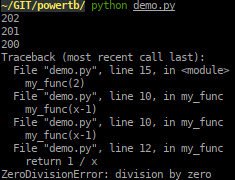
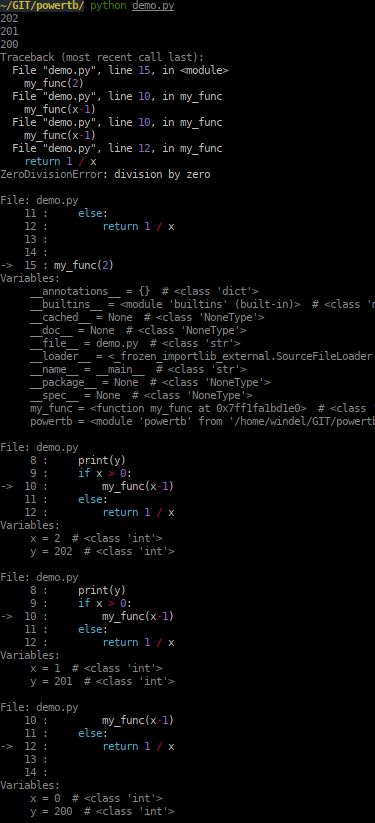

# powertb

Welcome to powertb, powertb gives your tracebacks superpowers!

powertb turns this:

into this:

# Features

Features include:

- Syntax colored context.
- List of local variables and their types.
- Api compatible with cgitb.
- MIT licensed.
- Single file implementation. Drop this file into your project and use at will.

# Installation

    pip install powertb

# Alternatives

There is a long list of available traceback enhancers. This is the list, in alphabetical order:

- backtrace (https://github.com/nir0s/backtrace) -> Pretty versatile and offers options
- colored-traceback (https://pypi.org/project/colored-traceback/) -> colors tracebacks with pygments
- ptb (https://github.com/chillaranand/ptb) -> Add context variables to tracebacks

